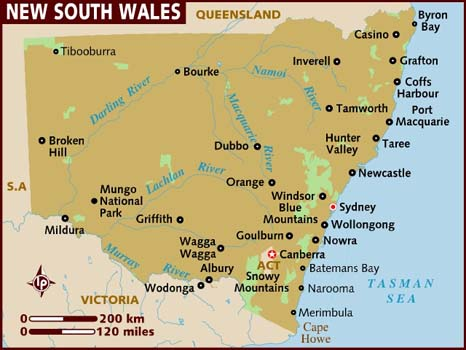
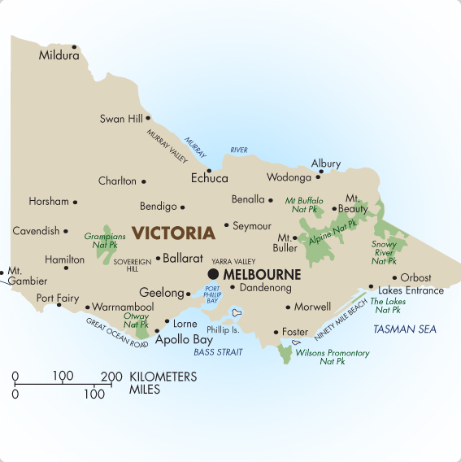
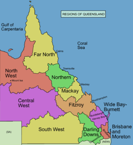

# Australian States and Territories
The states and territories in australia in **order** of population are: 

1. NSW
1. VIC
1. QLD
1. WA
1. SA
1. TAS
1. ACT
1. NT

### NSW

Here are some **unordered** facts about [NSW](https://en.wikipedia.org/wiki/New_South_Wales):

- Area of 809,952km
- 47 seats in House of Representatives
- Population of 8,128,984

### VIC

Here are some **unordered** facts about [VIC](https://en.wikipedia.org/wiki/Victoria):

- Area of 237,657km
- 38 seats in House of Representatives
- Population of 6,651,074

### QLD

Here are some **unordered** facts about [QLD](https://en.wikipedia.org/wiki/Queensland):

- Area of 1,851,736km
- 30 seats in House of Representatives
- Population of 5,129,996